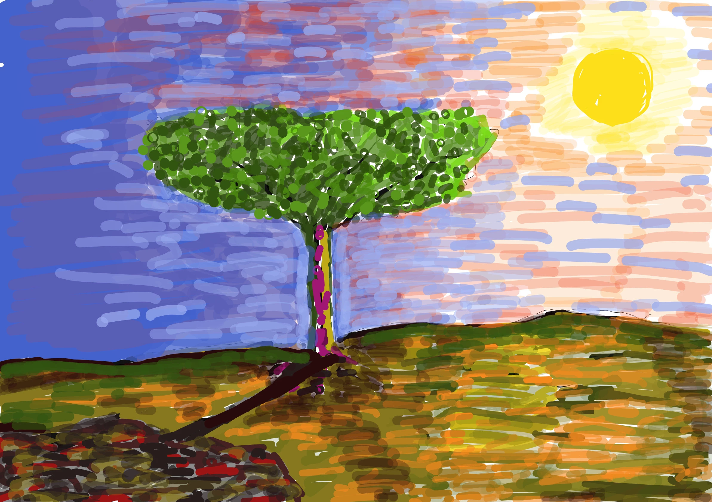

# Free Quantifier [View live project here on GitHub](https://alessiomigotti.github.io/project2/)

Welcome to Free Quantifier, the website that helps you understand how free you are! In today's world, we often hear the phrase "freedom" being thrown around, but what does it actually mean to be free? How do we measure our level of freedom and determine if we are truly free? This is where Free Quantifier comes in.

At Free Quantifier, we believe that freedom is a fundamental right of every individual, and we are committed to helping you understand the extent of your freedom. Through our unique approach, we provide a statistical analysis of your level of freedom by asking you five essential questions.

These questions have been carefully crafted by our team of experts, taking into account various aspects of freedom, such as political, economic, social, and personal freedom. Our aim is to provide you with a comprehensive and accurate picture of your freedom, so that you can take steps to enhance it further.

The questions we ask are designed to be thought-provoking and insightful, challenging you to consider your rights and freedoms in a new light. We understand that freedom means different things to different people, and our questions are tailored to ensure that we capture the nuances of your unique circumstances.

At Free Quantifier, we believe that understanding your level of freedom is the first step towards achieving it. Our website is easy to use, and you can get your results within minutes. We believe that everyone has the right to be free, and we are committed to helping you achieve that goal.

So, are you ready to find out how free you are? Take the Free Quantifier quiz today, and discover your level of freedom!

 

## Landing Page
 

.png)

 

## CONTENTS  
  
* [UXD (User Experience Design)](#user-experience-ux)
  * [User Stories](#user-stories) 
* [Creation process (Strategy -> Surface)](#creation-process)
  * [Wireframes](#wireframes)
* [Design](#design)
  * [Colour Scheme](#color-scheme)
  * [Typography](#typography)
  * [Imagery](#imagery)
* [Page Features](#page-features)
  * [Navbar](#navbar)
  * [Hero-Image](#hero-image)
  * [Tagline & Call to Action](#tagline--call-to-action)
  * [Landing Page](#landing-page)
  * [Survey Page](#survey-page)
  * [Footer](#footer)  
* [Tablet & Mobile View](#tablet--mobile-view)
  * [Desktop, Tablet & Mobile Differences](#desktop-tablet--mobile-differences)
  * [Tablet View](#tablet-view-ipad-miniipad-prosurface-pro)
  * [Mobile View](#mobile-view-iphone-5iphone-seiphone-xriphone-12-pro)
* [Future Features](#future-features)
* [Technologies Used](#technologies-used)
  * [Languages Used](#languages-used)
  * [Frameworks, Libraries, Technologies & Programs Used](#frameworks-libraries-technologies--programs-used)
* [Deployment](#deployment)
  * [How to deploy](#how-to-deploy)
* [Testing](#testing)
  * [HTML Validation using W3C Validation](#html-validation-using-w3c-validation)
  * [CSS Validation using W3C Validation](#css-validation-using-w3c-validation)
  * [Lighthouse scores via Chrome Developer Tools](#lighthouse-scores-via-chrome-developer-tools)
* [Credits](#credits) 

## User Experience (UX)  
  
### **User Stories** 

.png)
.png)
.png)
.png)
.png)
.png)
.png)

### **Primary Goal**  
  
The primary goal of Free Quantifier is to help individuals understand their level of freedom by providing a statistical analysis based on five essential questions. Our aim is to empower individuals to take steps to enhance their freedom and improve their quality of life.

### **Visitor Goals** 

Visitors to the Free Quantifier website can gain a better understanding of their level of freedom and how it compares to others. The website is designed to be easy to use, with a user-friendly interface that guides visitors through the process of answering five essential questions. The statistical analysis provided by the website can help visitors identify areas where they can improve their level of freedom, and take concrete steps towards achieving greater personal, social, economic, and political freedom. Ultimately, the goal of Free Quantifier is to empower visitors to lead more fulfilling and satisfying lives. 

### **First Time Visitor**
  - A user can access each page of the site with one click via the landing page.
  - A user can access the survey via the button located at the center of the landing page.
  - A user can view social media links via the footer.
  - A user can find a graph of there Freedom is displayed at the completion of the survey.

### **Returning Visitor**  
  - A user can quickly access the survey via the landing page to check there improvment.
  - A user can learn about the business ethos on the landing page.
  - A user can find social media links in the footer to learn more about Fee Quantifier.
  - A user can use the social links to connect with the business.
  
### **Frequent Visitor**  
  - A user can see opening hours quickly by scrolling down the landing page.
  - A user can view the social media links to check for system improvements.    

--- 

## Creation Process  
  
### **1. Strategy**  

- I required an easy-to-read, dependable website that delivers clear information about what the survey does.  
- Logo of the website must be visible and social media links available.  
- The retro aesthetic of Free Quantifier is to be carried on throughout the website with the use of consistent, clean design and use of graphics and colour to evoke an emotional and calm connection for the user.  
- Explenation within the landing page is to be transparent and simple.  
- Mobile responsiveness is an essential feature required for this website.
  

### **2. Scope**  

The Free Quantifier site must be available on a wide range of devices due to the varied range of customer ages. A large portion of their client base is liberals, over-20 age group, comprising mostly of hippies bringing their questions out for a quick answer. Free Quantifier provides a comfortable, no-fuss environment in the website.  

- The site is to contain only essential information, presented in a similar fashion and layout.   
- Text must be clear and legible on any sized device to allow the user instant access to the survey.  
- A brief description of the website is to be included on the landing page.  
- For future development, an ordering system for psycological requests will be included. Also, a large gallery page featuring images of shots of customers and staff.
  

### **3. Structural**  

Similar to the idea for the design and layout to be accessible and functional, simple navigation and interactivity were essential. The site needed to provide information swiftly no matter the age of the user.  
- Easy to identify, clickable links with a consistent layout. The design was to be predictable for each page with the information clearly identifiable.  
- Any buttons had to provide to the user to identify their score in the form of a design change that followed the flow of the overall aesthetic.  
- A large, clear button to bring the user directly to the menu would be placed front and center of their eye-line.  
- In addition, the navigation logo and footer would be visible on every page, at every device size, displaying the same information. This would provide the returning customer with a faster route to their information destination, strengthening the site's familiar and trusting feeling.  

  
### **4. Skeleton**  

The site was developed to be simple, clear, and familiar.  

- For the landing page, the logo, Free Quantifier, was to be top-center of every page, no matter the orientation or screen size.  
- The simple, item navigation logo of will take you to the index, is situated always to the top-center of the page.  
- A large, clear image dominates the landing page.  
- Centered in the page is a intoduction with a large, clickable button situated immediately below it. First-time visitors have access to the survey with one easy click.  
- The page ends with the footer, again offering four pieces of important information to the user, Copyright, Twitter, Instagram and Facebook.  

- For the survey page, the navigation logo and footer remain as before. Between these lies the survey items laid out in identifiable, headed sequential sections. Question from the most brilliant minds in the freedom phyilosophy intersected with the expetise of comportamental analyst that created the questions and option following the CBT (Cognitive behavioral therapy). That have a multiple answer choice, where one has to be selected to proceed to the next question.  
  
- For the results, the navigation and footer remain as before. One section is presented with explanatory headings. An optional selection for visitors who wish to get a clearer view of the graph, an interactive legend within the frame.   

### Wireframes  

Wireframe - Free Quantifier
  

.png)

 
           

### **5. Surface**  

 A design was created that allowed a consistent flow throughout the two-page site.   
 - On the landing page the background was designed to reflect the surveys frame used by the Free Quantifier website.   
- A palette of green, red and black was created, to inspire calmess.   
- Corners on all button elements are rounded to maintain a retro feel. 

Overall, the design was intended and created to foster the emotional and familiar connection customers have with freedom.  
 
---   
  
  
## Design  

### **Color Scheme**  

This website used a fresh, bold palette of whites and greens to capture the aesthetic of a traditional survey. The colours reminded me of calmness and freedom. I combined these with an black text and red graph line that felt clean.  
  
.png)  
  

  

  
[Adobe Color](https://color.adobe.com/create/color-contrast-analyzer) provided this fantastic resource for checking how accessible your colours are. I submitted my palette to the [Color Blind Safe](https://color.adobe.com/create/color-accessibility) check to find they passed this test also.  
Colour contrast ratio for graph average
.png) 
Colour contrast ratio for graph score
.png)
Colour contrast ratio for frame and background landing page  
.png) 
Color Blind Safe Check
.png)
  
### **Typography**

.png)

### **Imagery**  
  
The images that I have chosen for my site reflect the bright, retro aesthetic I am looking for. Close-ups of large displays of a landscape create a positive feeling for the user, prompting them to delve further into the suvey section. A large image sits on top the explation and survey, it shows the art of one of the most creative mind of this century Guido Migotti. The app [sketchbook](https://apps.apple.com/us/app/sketchbook/id883738213) was used to drow it, with the use of an ipad and a digital pen used throughout the art.  Attributions to the artist are placed in the [Credits](#credits) section of this README doc.

---  
  

## Page Features  

### **Navbar**   

  

.png) 

This remains the same across the two pages, in portrait/landscape and mobile/tablet/desktop view.
  
   

### **Logo**  

  

  

The hero image remains the same across all devices, with it becoming square-shaped for smaller screens.  

  

### **Tagline & Call to Action**  

 

.png)  

 The call to action button was given different shades of the original colour palette to allow its contrast ratio to conform to the accessibility needs of the site.

 

 
  
### **Landing Page** 

 

.png)  

The green background occupies the whole page, with black text styled by default. A large image of the artist is situated at the top of the page. The start the game button ridirects to the survey.

 

### **Survey Page**  

 
.png)

.png)

.png)

.png)

.png)  

The survey page includes a result graph. Two lines one red to deline the averege and a dark green line for the results, interactive legend, sitting on top of the graph. 

.png)  

 

### **Footer**  

.png) 

The footer remains the same throughout the design. It contains important information for the user and a clickable link to the map page in the 'Find Us' heading.  

 

## Tablet & Mobile View  
 
### **Desktop, Tablet & Mobile Differences**  
  
To ensure responsivity I used media query in my CSS styling. Mainly the survey area. [View of Am I Responsive](https://ui.dev/amiresponsive?url=https://alessiomigotti.github.io/project2/index.html)

  
### **View **  
  
.png)

 
  
.png)

                              

## Future Features  

- For future development, I would like to include an ordering system on the website to allow customers to order menu items for takeaway and a form element for larger orders to cater for parties and events.  
- An embedded video of the in-house ice cream production, showing customers how to make ice cream from beginning to end.
- A gallery page of dessert specials, events held at the parlour, and candid photos of customers and staff.
  
---   
  

## Technologies Used 

[Am I Responsive](https://ui.dev/amiresponsive?url=https://alessiomigotti.github.io/project2/index.html)
[Sketchbook](https://apps.apple.com/us/app/sketchbook/id883738213)
[Bootstrap](https://getbootstrap.com/docs/5.3/examples/)
[Chart.js](https://www.chartjs.org/docs/latest/)
[Figma](https://www.figma.com/?fuid=)
[User persona](https://userpersona.dev/)
[MDN](https://developer.mozilla.org/en-US/)
[W3 schools](https://www.w3schools.com/js/)
[W3 HTML validator](https://validator.w3.org/)
[W3 CSS validator](https://jigsaw.w3.org/css-validator/)
[Miro.com](https://miro.com/app/dashboard/)

### **Languages Used**   

- HTML5
- CSS3
- JavaScript

### **Frameworks, Libraries, Technologies & Programs Used**  

- GitHub - used to save and store all files for this website  
- Git - used for version control 
- Adobe Color - for all color palettes and accessibility contrast ratios    
- Google Dev Tools - to debug and for testing responsiveness 
- Google Lighthouse - for auditing the website

## Deployment

### **How to deploy**  

GitHub was used to deploy the website. These were the steps taken to acheive this:  

1. Login to GitHub account
2. Navigate to the project repository, project2
3. Click the Settings button near the top of the page
4. In the left-hand menu, find and click on the Pages button
5. In the Source section, choose 'main' from the drop-down, select branch menu
6. Select 'root' from the drop-down folder menu
7. Click 'Save' and after a few moments the project will have been made live and a link is visible at the top of the page

.png) 

---  
    

## Testing  

### **Initial testing plan**

I had planned for this site to be accessible and legible on all screen sizes. The user is viewing the site primarily for the menu options and parlour location and they needed to access this information with one click. I used Chrome Dev Tools to test, tweak and debug in the early stages. I deployed my site halfway through to test on real-world devices. These devices included:  
- Acer Aspire 3 Laptop (1920 X 1080)  
- EliteDisplay E201 24" Monitor
- iPad Pro 2021
- iPhone SE(2016)
- Huawei p30 Lite 
- iPhone 11/13
- Samsung Galaxy s10 
  
### **Testing**    

Testing took place throughout the entire build using Dev Tools on Chrome and on the above real-world devices. The browsers used were:  
- Chrome   
- Safari  
  

 
### **HTML Validation using W3C Validation**  

Page HTML validation
  

.png)

   

Page CSS validation
  

  
 
  
   

### **CSS Validation using W3C Validation** 

Free Quantifier CSS validation
  

.png)
.png)

   

   

### **Lighthouse scores via Chrome Developer Tools**   
  
For Desktop   

Lighthouse audit for landing page
  

.png)

 

Lighthouse audit for survey page
  

.png)

     

 
  
For Mobile   

Lighthouse audit for landing page - Mobile
  

.png)

 

Lighthouse audit for survey page - Mobile
  

.png)

      
  
  

## Credits  
  
### **Content References**
- All content written for the website is by myself, is purely fictional, and for educational purposes only.
- [Code Institute](https://codeinstitute.net/ie/) for their HTML/CSS/Javascript learning material.
- [W3Schools](https://www.w3schools.com/) for additional learning material.
- [MDN Web Docs](https://developer.mozilla.org/en-US/docs/Learn/CSS/CSS_layout/Flexbox) for flexbox tutorials and guidance.
- Richey from WAES Tutor Support for helping me with some questions i had.
- [StackOverflow](https://stackoverflow.com/questions/66564503/wrong-validation-on-element-br-in-ul-li-elements).
- [Scoops](https://github.com/Code-Institute-Submissions/scoops_pp1/blob/main/README.md#navbar) Design inspired README ice cream parlour website.
 
  

### **Acknowledgements** 
- I would like to acknowledge Code Institute for there learning material, and Richey Malahotra for the advice and encouragement for this project.
- My family and friends for testing my work and offering positive thoughts. My self for food and hot cups of tea throughout the project.

# So don't hesitate and come check out the website [Free Quantifier](https://alessiomigotti.github.io/project2/)